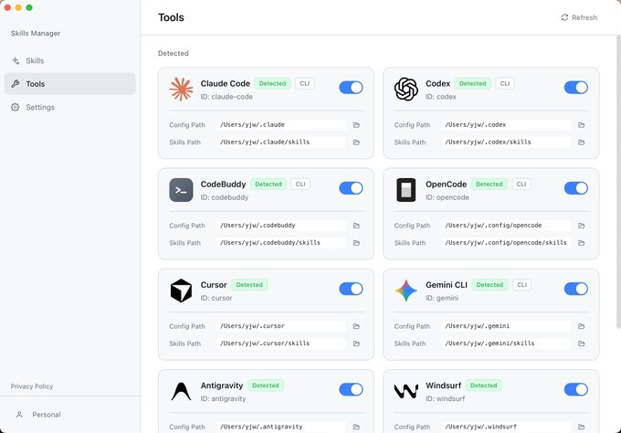

# Skills Manager AI 技能管理器

**来源**: X (Twitter) - @QingQ77
**发布时间**: 2026年2月7日 上午4:27
**原文链接**: https://x.com/QingQ77/status/2019991294953791848

## 内容

Skills Manager 是一款现代化的桌面应用程序，旨在解决 AI 助手的 Skills 配置碎片化的问题。它提供了一个中心化的枢纽，让您不再需要为不同的工具分别管理 Skills 技能。

通过强大的软链接同步机制（Symlink Synchronization），您只需编写一次技能，即可在 **Claude Code、Codex、Opencode** 等支持的 AI 工具中即时生效，实现一处编写，多处使用。

## 项目链接

https://github.com/jiweiyeah/Skills-Manager

## 互动数据

- 浏览: 16.5K
- 回复: 7
- 转发: 35
- 点赞: 226
- 收藏: 299

---
*Updated by Life-OS at 2026/2/8 02:47:29*

原文链接: https://x.com/QingQ77/status/2019991294953791848

标签: #Twitter #笔记

---
*Updated by Life-OS at 2026/2/8 02:51:06*

原文链接: https://x.com/QingQ77/status/2019991294953791848

标签: #Twitter #笔记

