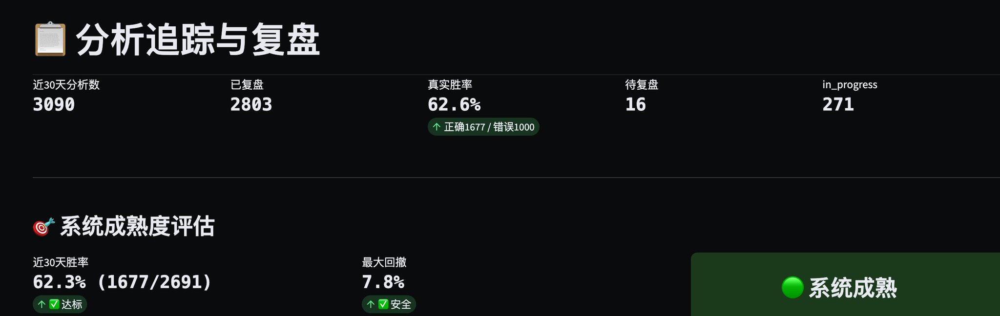
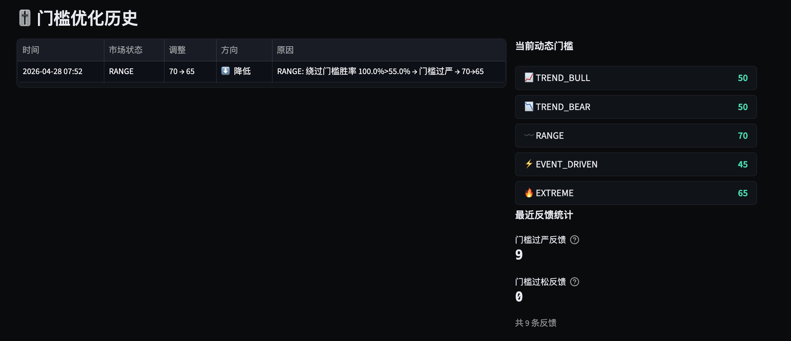
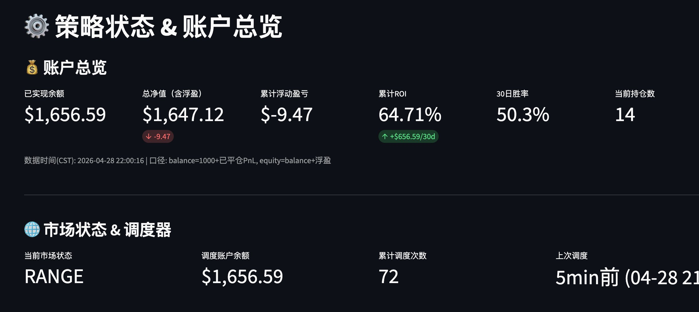
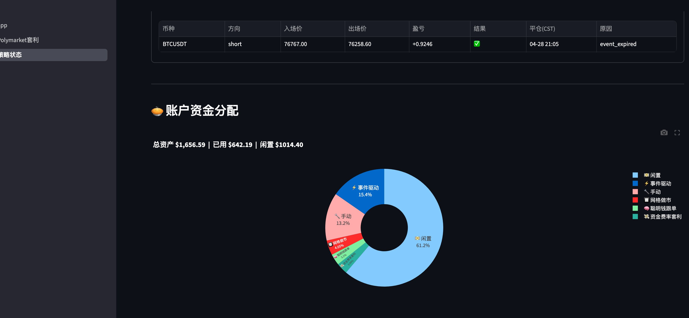
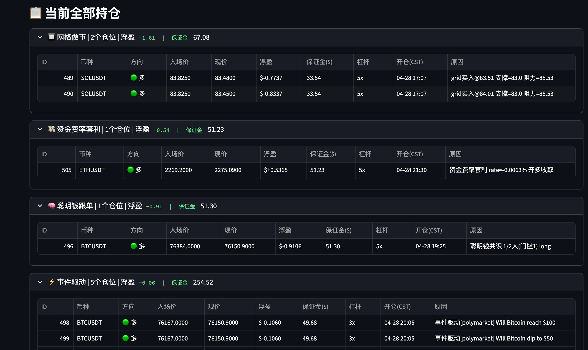
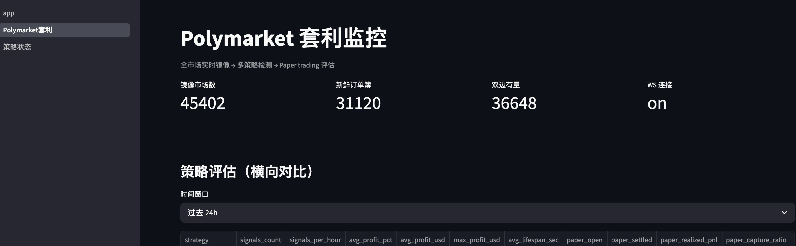

最近看到大家都在发自己的量化，我也分享下自己的量化，大概跑了半个多月，从Openclaw 换成 Hermes 后就一直在构思这个系统，我没研究过现在和过去其他人的量化逻辑，但我这个目前胜率还凑合，从 1000u 的本金也跑到了 1600+，说下基本自己的思路，也能和大家碰撞想法和交流：  
  
🌟AI 是 Claude + Hermes ，claude 搭系统，Hermes 来分析策略和执行，95% 是 7x24 服务器上跑不占用 大模型Token  
  
🌟核心逻辑和共识是 —— 一个真正会自己学习的Agent。她能记住每一次判断对错，能从失败中提炼经验，能主动调整自己的判断逻辑。就像一个真正的交易员，刚入行时新手，做久了变老手。  
  
就拿我自己来说，从 openclaw 出现以来就在不断的使用学习试各种skill 和方式让他变得更智能更主动的帮我做事，但是实际上他本质逻辑就是个定时器，时间到了开始做事，所以基于这个逻辑想要无缝 7 x 24 的跑下来就必须有个合理的闭环让他循环，我是这样思考的：  
  
1⃣每次决策都留痕  
  
简单来说我每一次跟我的 Hermes 聊天让他帮我每分析或开仓，系统会自动记录一份"决策快照"：  
  
·当时的市场温度（恐贪指数、VIX）

·币种的技术指标（RSI、ADX、量价）

·订单簿的真实买卖情况

·聪明钱在做什么方向

·宏观环境（关税期？FOMC期？）

·Polymarket在赌什么/对应 token 是否有盘口

·为什么做这个判断（理由）

·预测的方向和目标价  
  
这就像一个交易员的工作日记，每笔交易都写下"我为什么这么做，现在是什么环境的判断"。  
  
2⃣24小时后回头看（可以根据我问的情况自动判断时间戳）  
  
24小时后，系统自动回访这笔决策：  
  
当时Hermes说"看多ETH，目标涨3%"

24小时后实际：ETH涨了2.5% → 标记为"判断正确"

24小时后实际：ETH跌了1% → 标记为"判断错误"  
  
这个回访不是简单看价格，而是要分析复盘为什么对、为什么错。  
  
3⃣让AI自己复盘  
  
这里是最关键的一步。如果判断错了，系统会自动把错误的分析和实际结果发给MAKIMA本人，让她自己复盘：  
  
"你24小时前分析ETH看多，给出Conviction 72分 当时你的依据是：RSI超卖、订单簿买盘强、聪明钱方向一致但实际ETH跌了2%

请复盘：

1\. 哪个信号判断失误？

2\. 当时忽略了什么？

3\. 下次遇到类似场景怎么处理？"  
  
Hermes会给出复盘结论，比如：

"忽略了Polymarket 的反向信号，当天 ETH 的盘口预期不足以造成拉盘，市场预期ETH会跌 聪明钱信号有滞后性，不能完全依赖 下次遇到 Polymarket 反向时应该谨慎做多"  
  
这条复盘自动归档到经验库，带上标签：  
  
「币种：ETH

RSI区间：超卖

宏观环境：FOMC前

失败原因：Polymarket反向被忽略

教训：Polymarket反向时聪明钱信号需折扣」  
  
4⃣下次遇到类似情况，自动调取经验  
  
这是真正让她"成长"的核心。  
  
下次Hermes要分析任何币种时，系统会智能搜索经验库，找到Top3-5条最相关的历史经验，注入到她的判断上下文：  
  
"现在分析ETH，参考你的历史经验：  
  
「经验1（30天前，类似场景）：

ETH超卖+宏观平静期，做多成功，关键是订单簿买盘强

经验2（45天前，反面教材）：

ETH超卖但Polymarket反向，做多失败，被打止损

经验3（15天前，类似场景）：

ETH超卖+聪明钱共识，做多成功率高」  
  
请结合这些经验给出判断"  
  
她不是从零开始判断，而是带着"过去同样情况下的经验"做决策。  
  
🌟这套闭环的意义：  
  
普通量化：人写规则 → 静态系统

我的量化：自己积累经验 → 动态成长  
  
第1周：按基础逻辑判断

第4周：积累了几百条经验后，遇到熟悉场景能直接调取 第3个月：经验库足够丰富，胜率开始指数级提升

第6个月：成为这个特定市场环境下的"老手"

理论上，操作越多，胜率应该越高。每一次错误都不是浪费，而是在喂给她未来的判断力。  
  
💡一个具体的例子  
  
4月15日：MAKIMA分析BTC，看多，结果跌了 归档经验：BTC在RSI=42+ADX=20的震荡市做多，失败  
  
4月22日：又遇到BTC RSI=44+ADX=22+震荡市 系统调取  
  
4月15日的经验作为反面教材 Conviction从60分扣到48分（不开仓） 后来BTC确实又跌了 → 避免了一次亏损  
  
5月5日：BTC RSI=38+ADX=45（这次是趋势市） 系统调取经验时，发现4月15日的反面教材"市场状态不同" 权重降低，不影响这次判断 正常开多，赚了  
  
「她学会了区分场景，不是机械套用经验，而是判断"过去的经验在当前是否适用"。」  
  
·不让Agent绕过规则，而是改进规则  
  
我们最初遇到一个问题：Hermes有时会觉得系统设的门槛太严，自己绕过去开仓。  
  
我们没有限制她，而是给了她一个"反馈机制"：  
  
觉得门槛过严？写入feedback.log 觉得规则不合适？告诉系统 "你不是在忍受规则，你是在训练系统"  
  
每周日系统自动统计这些反馈：  
  
如果"觉得过严但实际开仓胜率>55%" → 门

槛自动降低  
  
如果"按门槛开仓胜率<45%" → 门槛自动提高

她的每个想法都被听到，每个反馈都在改进系统。  
  
弄这套东西的原因是我比较懒，但是在不了想学习外面的量化系统策略和逻辑，那么我就想弄一套东西不断的跑，我甚至懒得告诉他怎么跑。

这套系统我第一件事就是让他把现在到过去 2 个周期的 K 先放量价格等所有数据跑一个遍，然后把关键节点价格做上坐标，然后根据这个坐标找相对于宏观事件都发生了什么，分析原因，快速积累经验。每天和 claude 聊的最多的就是 Hermes 还缺什么，如何继续完善，怎么让他成长的更精准  
  
下面发几个自己的面板（我为了他在干什么我能看得见，还建立了个模板清晰看到他在做什么）

我还单独设计了一套监听系统分析防止为满足Conviction 分数长期不开单空仓情况，专门学习正对什么大盘环境下调整开单评分：

策略面板： 详细可视化每个板块，细分每个叙事推动下开的仓（全部他自己学习总结的，我什么策略都没给）还可以发送数据结果到 tgbot。

我还镜像了一套 polymarket，每天分析接近 5w 市场订单寻找套利机会

