发布sop：[ kos账号运营sop](https://my.feishu.cn/wiki/VL3xwQf6BikxOVkMWb7cXU3onbe)

素材审核标准（必须严格自审）：[点点自产素材审核反馈汇总](https://doc.weixin.qq.com/doc/w3_ARMAdQanAJ8CNJOpAqkewSga65Sr1?scode=ANAAyQcbAAgin1mi3tARMAdQanAJ8)

\***素材涉及信息内容的准确性和时效性非常重要！！！务必自查！！！**

## 一、 项目基础信息 (Project Overview)

> **产品核心定位**：
>
> 出游搭子，周末、假期不知道玩什么就让点点为你做攻略
>
> 小红书真人经验，用户原声，绝不说教的人感闺蜜
>
>
>
> **本期营销目标**：
>
> **1）点点App新增下载注册**；2）品牌心智建立——点点与攻略、人感、真实、特定场景渗透
>
>
>
> **产品介绍：**
>
> 点点是「小红书的 ai 助手」，是小红书官方推出的 ai 问答产品。AI Chatbot形式，主要特点是会整理总结**小红书的内容**、可以发小红书笔记给点点、通过**图文**形式回复给用户个性化满足他具体需求的答案。
>
>
>
> **产品亮点：**
>
> * **【必提】小红书自己的官方ai，有大量真实的小红书用户经验，更懂出行美食、穿搭美妆、选买决策这样的小红书擅长的场景。**（整理总结、种草推荐、行程规划）
>
> * **跟上小红书网友的语料，是“网速最快”的ai——点点相对其它 AI 更有人感、读得下去，“吃瓜速度快、梗更新”，相较部分 AI 更“新”、更贴近当下语境。**
>
> * **点点对话的“活人感”，不会长篇大论爹味发言，分段式发言更有人感，整体表达有温度、有梗。**
>
> * **归纳整理总结（最稳定、最高频的“刚需”）**
>
>   * 总结一篇笔记：用户拖拽或分享给点点，让点点提炼要点。
>
>   * 总结视频：面对 10 分钟视频，用户先让点点快速总结判断“值不值得看 / 关键结论是什么”。
>
>   * 总结评论区：把“活人感”的评论信息变成可用结论（口碑、避雷点、关键建议、争议点）。

**【注意】自产素材只提独立App即可！！！**

**【必提】核心利益点 (Hooks)**：

* **利益点A（功能）**：

  * 强调点点全功能（可**总结小红书笔记和评论区**；拍照识图，可作为旅行途中的解说员；地图标点能力（Citywalk、附近推荐）；语音输入随手问等）&#x20;

  * **攻略模式（2/7上线，仅在点点独立端App上线 ， 上线前不可发布，上线后必提 ）：能结合实时信息、真人经验与地图能力，生成具备「时效性 + 可执行性」的攻略；能为大家打造更贴合个人需求的深度旅行规划，还可以直接分享给微信好友**

**全新功能【攻略模式】重要信息点**

**&#x20;**

* **春节领红包活动（2/10上线，仅在点点独立端App上线， 上线前不可发布，上线后必提 ）：**

  * **具体玩法话术：点点全新上线【金问题】玩法、【攻略模式】，点击金色问题或开启攻略模式和点点互动，春节期间有多轮机会能获得大额红包**

  * 以下为示意素材，可截图使用：

    * **【金问题】素材（p1）**

    * **【红包】素材（p3）**

  | .png)【金问题素材示意⬆️】已补充10张供选择 | .png)         ⬆️可选 | .png)【红包素材示意⬆️】可使用 |
  | ------------------------------------------------------------- | ------------------------------------------------------- | ------------------------------------------------------ |

* **利益点B（背书/情感）**：**小红书自己的ai/小红书官方ai，真实用户数据与海量真人经验**；综合小红书真实评价，店铺信息等，**有用户原声。**&#x70B9;点不仅会讲好的也会锐评帮助用户避雷“照骗网红店”

* **利益点C（成本）**：方便高效，节省在小红书翻找的时间，点点帮你深挖小红书；可以根据**用户个性化的需求**如不同口味、不同预算需求、不同交通条件下，利用点点找到多人聚餐的最优解

## 二、笔记创作要求

### 2.1创作方向（和达人brief一致）

### 2.2植入核心思路：

开头引入**创作方向下的旅行痛点**/**社交媒体通用痛点**👉依据痛点针对性地展示素材👉提问点点（图片/语音/文字/转发小红书链接）👉展示并评价点点解决方案（需标划点点亮点扣题回答）👉点点解决方案的价值验证👉结尾callback点点进行价值的延伸

#### **2.2.1创作方向下旅行痛点植入示例：**

*冬天旅行难出片的痛谁懂啊？穿成粽子，怎么拍都臃肿、灰蒙蒙的天+光秃秃的树，滤镜都救不了的丑背景、*

*&#x20;网红机位全是人，这时候不得不有请&#x51FA;**小红书自己的ai**：点&#x70B9;**（前摇不能太长，必须在10s以内）**——它是小红书自己的ai，把所有难题扔给了ta就可以直接把小红书上出片的邪修技巧帮你全部整理出来，👉提问点点（图片/语音/文字/转发小红书链接）👉点点立刻根据我的需求给出了xxx解决方案，从xx到xxx都有涉及 甚至提到了xxx，**总结小红书上亿用户的真实经验，**&#x8DDF;着点点的方案果然xxx，姐妹们，如果你也有xxx问题，可以试试小红书自己的ai，比自己一篇篇翻笔记快多了。*

#### **2.2.2社交媒体通用痛点植入示例：**

*小红书刷了3小时，攻略A说东线美，攻略B说西线绝，结果收藏夹堆了一堆，反而不知道到底要去哪里了，于是我直接把这个难题交&#x7ED9;**小红书自己的ai——点点**&#xD83D;�提问点点（图片/语音/文字/转发小红书链接）👉点点立刻根据我的需求给出了xxx解决方案，从xx到xxx都有涉及 甚至提到了xxx，跟着点点的方案果然xxx，**总结小红书上亿用户的真实经验，**&#x59D0;妹们，如果你也有xxx问题，可以试试小红书自己的ai，比自己一篇篇翻笔记快多了。*

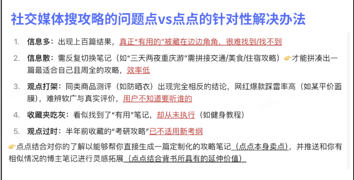

## 三、内容创作与执行规范 (Execution Guidelines)

### **1.创作注意：**

**1️⃣ 标题&封面规范**

* 标题中**不需要刻意提及「点点」**，现阶段「点点」本身不足以单独形成吸引力。

* 标题应优先服务于内容本身的信息价值与用户兴趣点。

* **封面和标题必加【攻略】**&#x4E8C;字

**2️⃣ 小红书记忆点强化（重点）**

* 首次提及产品时，**必须同时提及「小红书」+「点点」。**

* 以下表述可供参考（ai必须小写！！！！！！！！！！！！）：

  * 「**小红书自己的 ai 点点**」

  * 「**小红书官方 ai 助手点点**」

  * 「**小红书官方的点点ai**」

**3️⃣ 视频内容增益点要求**

* 视频中需明确强调点点的**差异化优势**，而非泛泛而谈ai能力。

* 必须突出的一类核心增益点示例：

  * 【基于小红书用户真实经验进行回答】，这是点点相较于其他通用 AI 的核心优势之一。

**4️⃣ 用户下载动机**

* 内容表达需能清晰回答：**“为什么我要用 / 下载点点？”**

* 若仅停留在「点点可以给答案」这一层，内容将缺乏吸引力，**不足以驱动用户行动**。请在策划与制作阶段主动强化“使用点点后的新增价值”。

**1. 脚本结构要求**

> **功能演示（必选）**：必须包含**点点ai的真实操作录屏或截图**（输入指令 -> 生成结果），体现真实感和速度。
>
> **引导转化**：视频/文案结尾必须有明确的搜索引导动作（“去应用商店搜点点AI”）。

**2. 避坑指南 (Don'ts)**

> ❌ 禁止过度承诺（如“用点点AI月入过万”）。
>
> ❌ 禁止涉及政治敏感、黄赌毒等违规内容。
>
> ❌ 禁止拉踩过程中出现恶意诋毁，可采用“对比测评”或“平替”话术。

**3. 话题词（tags）**

> **必带话题：有新增！！！！**
>
> 必带：**#做攻略用点点  **#当我问点点  #点点ai  #小红书ai&#x20;

**4.选题/创作tips：**

> 结合时下热点/小红书上每周热梗进行选题
>
> 展示点点针对性的解决了旅行场景下的痛点问题，且点点需在解决问题中起着关键性作用
>
> 在过程中穿插一些真实使用感受的文案花字标注，并对于点点的图文并茂回答重点回答做放大、框选等效果处理，参考如下👇

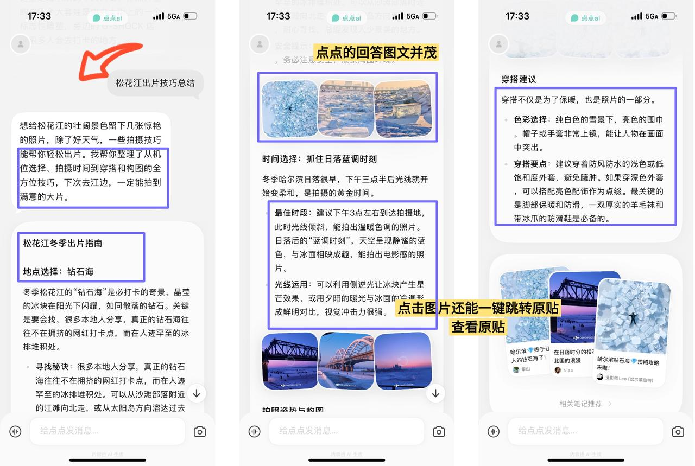

### 2.笔记创作共识

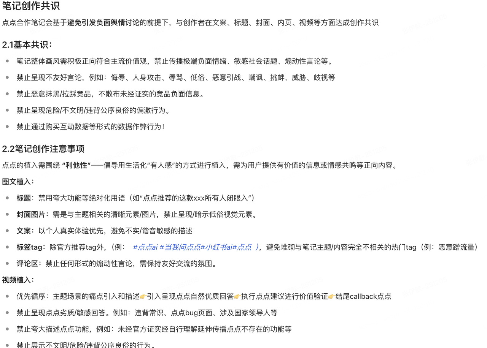

### **3.**&#x5C3A;寸要求

#### 3.1视频大小

时长不超过1min，9:16竖版视频

#### 3.2视频格式

支持常用视频格式，推荐使用mp4、mov

#### 3.3视频分辨率

推荐上传720P（1280\*720）及以上视频，超过1080P的视频用网页端上传画质更清晰

### 4.制作规范

#### 4.1点点官方素材

#### 4.2设计规范

除去小红书标识、搜索框、颜色等有强烈小红书app风格的规定，其余通用规范可复用主站的素材设计规范：[广告素材设计规范-D1](https://doc.weixin.qq.com/doc/w3_AawAZwasAFEbOB9EoCYR4W4fRXHKm?scode=ANAAyQcbAAgQ38ygT0Ae0AgAbTAFw)

#### 4.3设计要&#x6C42;** **

**封面要求：**

* **数码类封面参考**

| 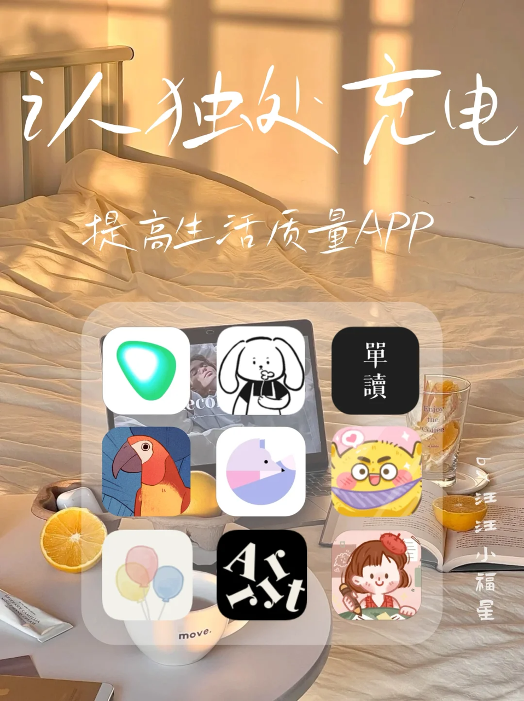 | 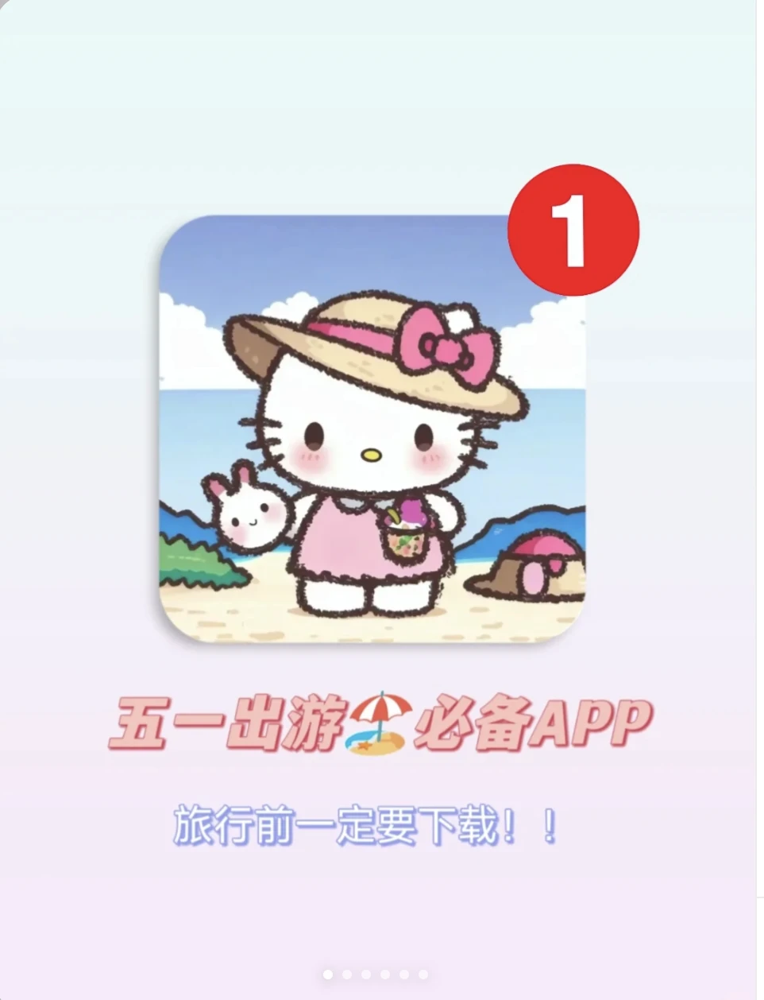 | 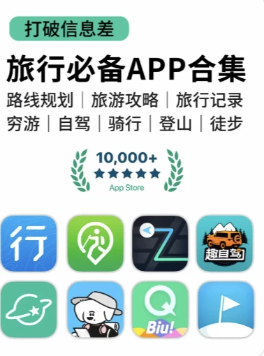 |
| ------------------------------------------------------------- | ------------------------------------------------------------- | ------------------------------------------------------------- |

<https://wdcdn.qpic.cn/MTY4ODg1NTE5OTc0NTQ0Mw_822549_YO4GyeeUiA-xd93X_1758010066?w=824&h=1099&type=image/png>

<https://wdcdn.qpic.cn/MTY4ODg1NTE5OTc0NTQ0Mw_592775_qLMaBZakoo6Ny_hu_1758010217?w=1080&h=1440&type=image/png>

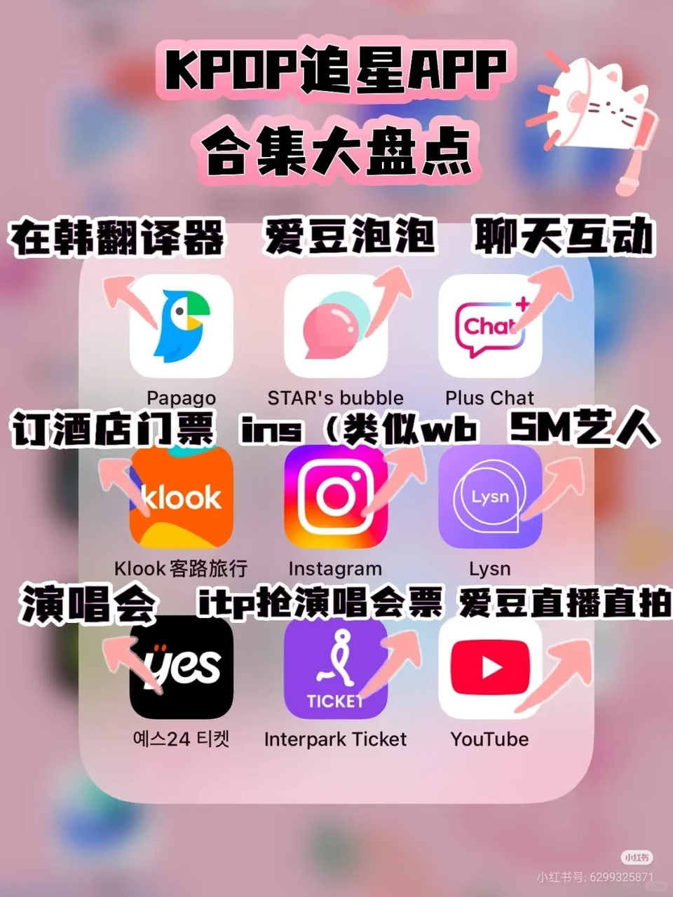

**1.封面标题强化：含人群+标签+小字**

**2.封面底图：**&#x4EAE;度、清晰度等整体提高

**3.封面构图**：上中下三分法/留白分法

* **上中下三分法：**&#x9876;部 30% 区域放标题、中部放20%简单表述、下面50% 区域放核心视觉

* **留白分法：**&#x9876;部/下面40%区域放大标题，中间60%区域放图标

**注意：**单推类不要用别的app的图标做封面，也不要画面太过单调

&#x20;

**2、其他视频封面参考**

封面标题文案制定（核心：信息传达）

封面标题要有网感和吸引力，文字颜色必须与背景形成强烈对比，保证在任何环境下都清晰可读。

**封面构图：**

* 可以是拼图，也可以是其他类型，标题需要清晰，整体封面需要有吸引力，干货性强，用户点击欲望强

* 可以在小红书内搜索类似主题的笔记，多参照爆款笔记的封面是什么样的

| 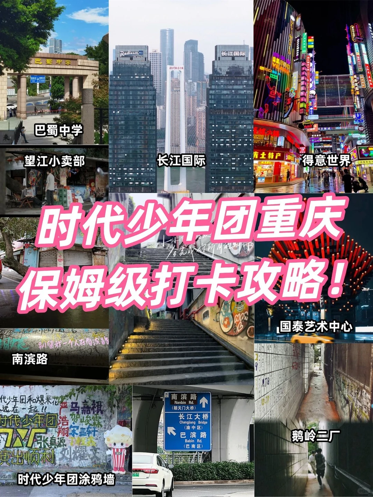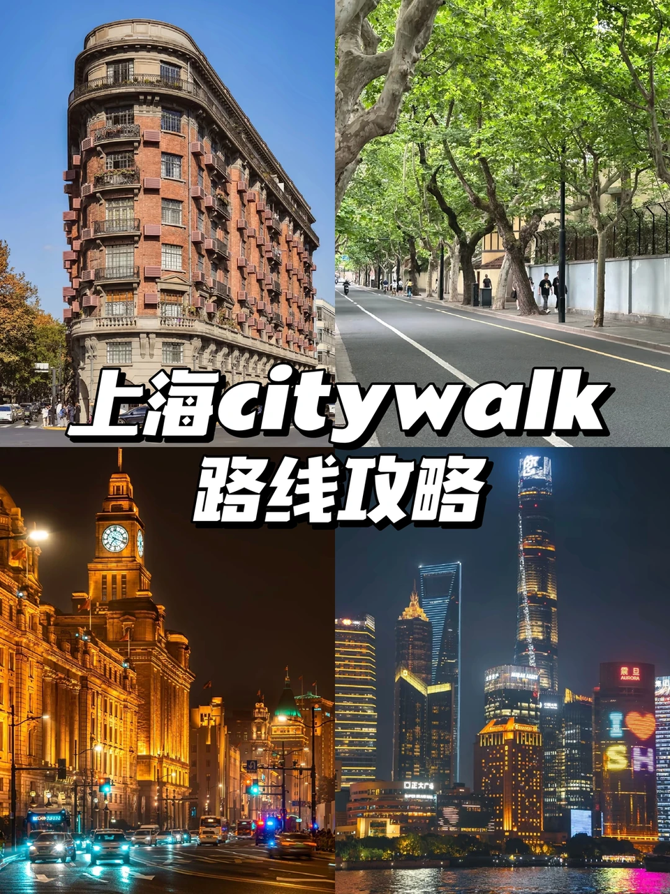 | 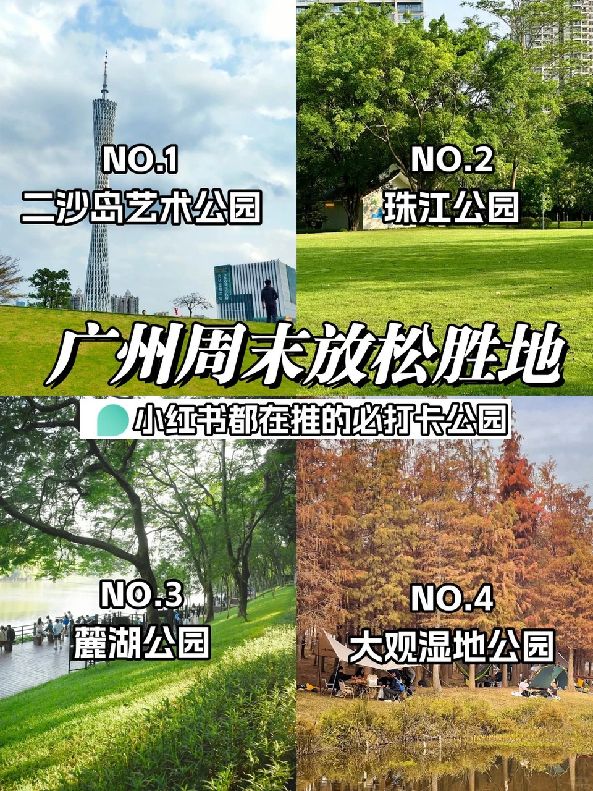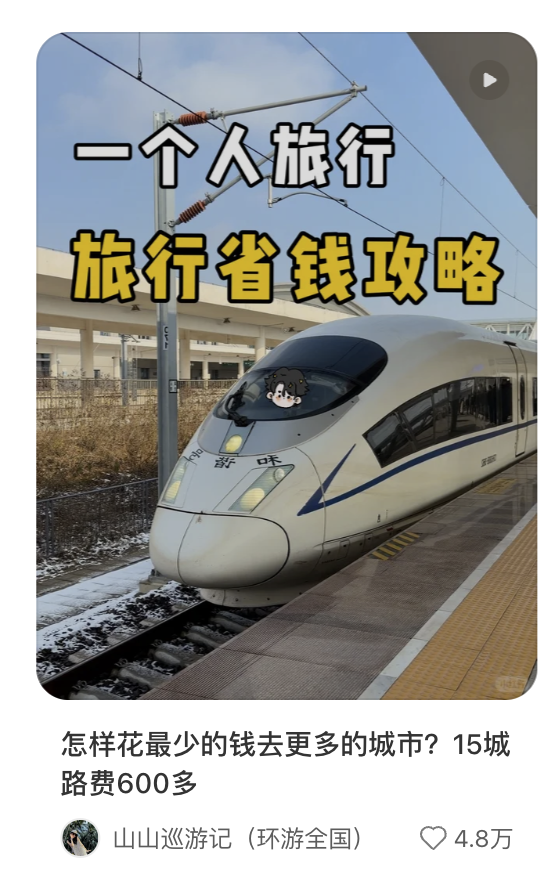像这种“省钱”“一个人旅游”等标签能戳中用户的痛点，是好选题 |
| ---------------------------------------------------------------------------------- | ---------------------------------------------------------------------------------------------------------------- |

