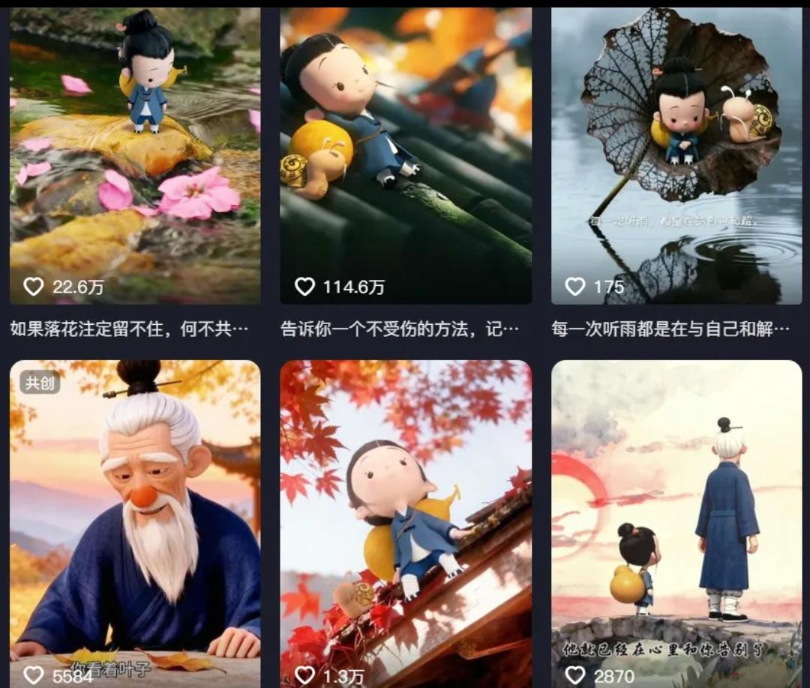
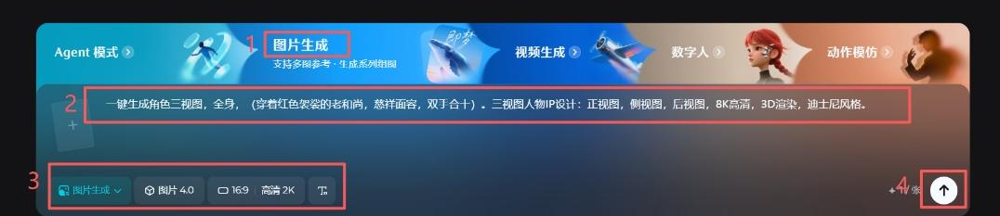
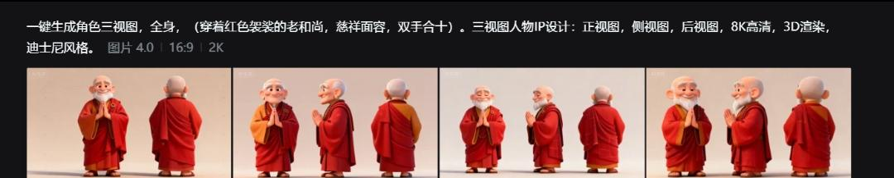
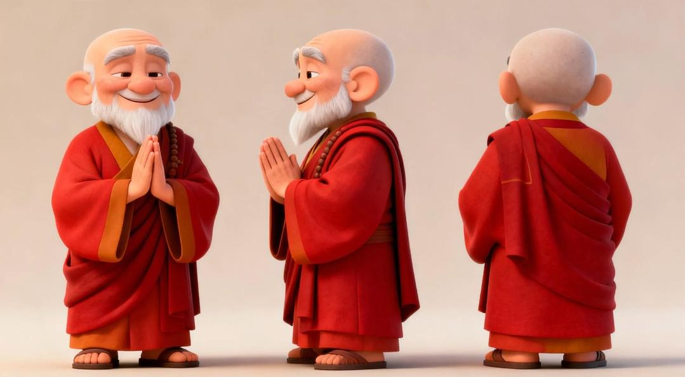
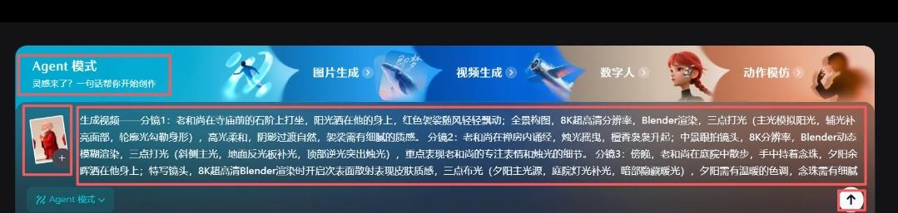
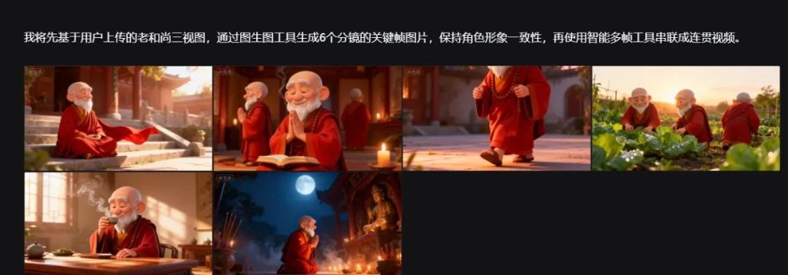
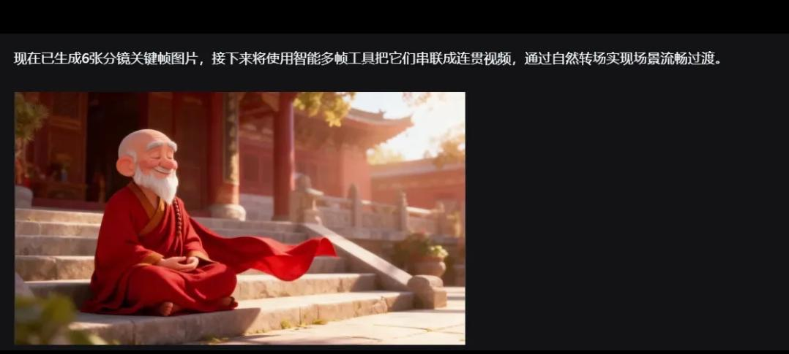
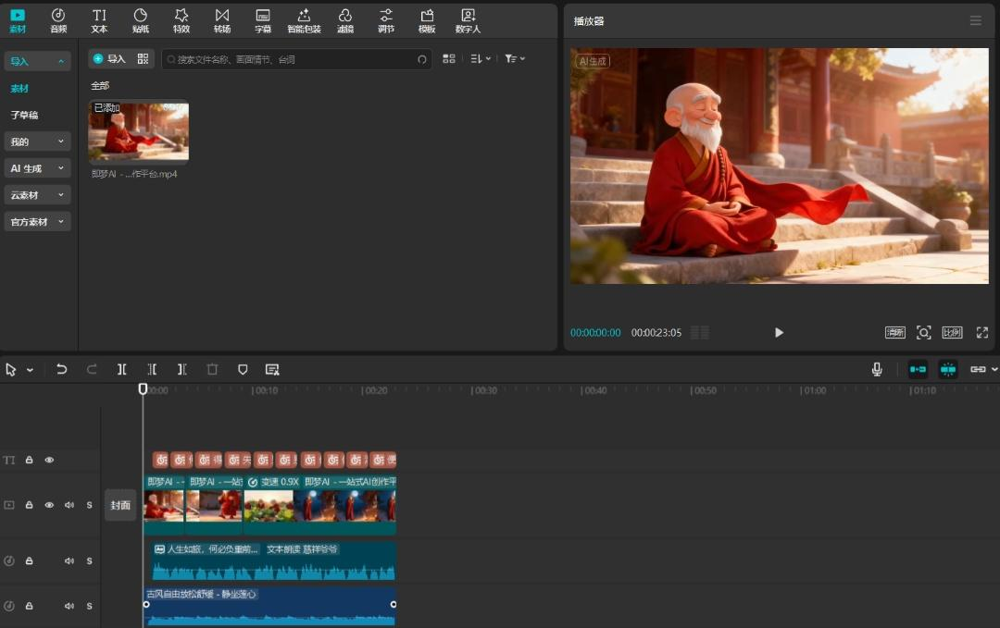

## 前言

嗨淘金的小伙伴们大家好呀，我是木林。一个专注AI短视频制作，喜欢借助AI工具制作各种不同的AI短视频的自媒体人。

今日分享爆款治愈视频制作，这类视频基本上都是一个卡通治愈人物，在一个环境中行走或者做事，搭配着富含哲理或是治愈的配音。这样就完成了一个治愈视频，具体怎么操作呢？话不多说，上教程。

### &#xA;**今日拆解-爆款治愈视频**

### **创作核心内容简述**

* *提示词分享*

* *即梦AI生成三视图*

* *即梦Agent生成视频*

* *剪映剪辑*

## 一：操作指南

### 提示词分享

1.三视图提示词： 一键生成角色三视图，全身，（穿着红色袈裟的老和尚，慈祥面容，双手合十）。三视图人物IP设计：正视图，侧视图，后视图，8K高清，3D渲染，迪士尼风格。  

2.分镜绘图提示词 

分镜1：老和尚在寺庙前的石阶上打坐，阳光洒在他的身上，红色袈裟随风轻轻飘动；全景构图，8K超高清分辨率，Blender渲染，三点打光（主光模拟阳光，辅光补亮面部，轮廓光勾勒身形），高光柔和，阴影过渡自然，袈裟需有细腻的质感。 

分镜2：老和尚在禅房内诵经，烛光摇曳，檀香袅袅升起；中景跟拍镜头，8K分辨率，Blender动态模糊渲染，三点打光（斜侧主光，地面反光板补光，顶部逆光突出烛光），重点表现老和尚的专注表情和烛光的细节。 

分镜3：傍晚，老和尚在庭院中散步，手中持着念珠，夕阳余晖洒在他身上；特写镜头，8K超高清Blender渲染时开启次表面散射表现皮肤质感，三点布光（夕阳主光源，庭院灯光补光，暗部隐藏暖光），夕阳需有温暖的色调，念珠需有细腻的质感。

分镜4：清晨，老和尚在菜园中劳作，阳光初升，露珠在菜叶上闪烁；广角镜头畸变控制，8K分辨率，Blender景深渲染，三点打光（晨光为主，菜园灯光补光，顶部柔光消除阴影死角），露珠需有晶莹剔透的效果，老和尚的动作需生动。

 分镜5：午后，老和尚在茶室里品茶，茶香四溢，阳光透过窗户洒下斑驳的光影；慢动作特写，8K超清，Blender流体模拟光影，三点打光（阳光逆光，地面反射光补亮面部，茶杯内部隐藏光源），要求光影有层次感，背景虚化的茶室需有真实感。

 分镜6：夜晚，老和尚在佛堂前跪拜，月光洒在他身上，周围香火缭绕；低角度仰视，8K渲染开启辉光效果，三点布光（月光冷调主光，佛像自发光，香火点光源阵列），月光需有柔和的质感，香火的烟雾需细腻。  

3.文案

温柔治愈风：生活就像一杯温热的茶，苦涩后总有回甘。累了就停下来，听听风的声音，看看云的形状。每一个清晨都是新的开始，每一份善意都会开花。愿你被世界温柔以待，也温柔对待这个世界。 

通透洒脱风：人生如旅，何必负重前行？得到的都是礼物，失去的都是风景。别为小事皱眉，别为过往纠结。像风一样自由，像云一样轻盈，活出自己的节奏，便是最好的修行。 

简约清新风：简单生活，阳光好的日子就微笑，下雨天就听歌。拥有的珍惜，错过的释怀。心若轻盈，处处皆风景。

## **二、即梦AI生成三视图**

### **即梦AI**

https://jimeng.jianying.com/（每天随机送60-100积分）

### 选择图片生成

-打开**即梦**，选择图片生成

-**模型：**&#x56FE;片4.0，比例16：9，标清2K（会员4K）

-对话框**输入**提示词-立即**生成**

-**点击**一张满意的图片，去画布编辑-导出**保存**

三视图就制作好了

## **三、即梦生成视频**

### 选择Agent模式

-打开**即梦**，选择Agent模式

-**上传**三视图

-**输入**分镜提示词

-立即**生成**

-分镜**效果**

-**继续**对话

### **生成**视频

视频生成完成后，需要给视频配上治愈音频。配音可以声音克隆或者用剪映里的系统配音也是可以的。关于配音的教程之前的文章有讲过，需要的朋友自行去看下历史文章。

## **四、剪映剪辑成片**

### 导入**剪映进行剪辑**

-将生成的视频素材全部导入**剪映**

-添加**背景音乐、音效等**元素

-最后调整**细节**，**导出**即可

这样一个**爆款治愈视频**就制作完成啦！这里重在教方法，大家自行去打磨细节，一起来看看成片效果吧\~

[WeChat\_20251022184415.mp4]()

