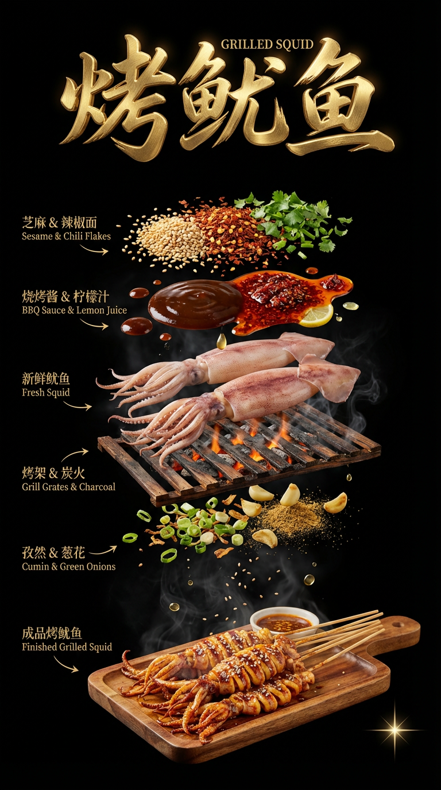
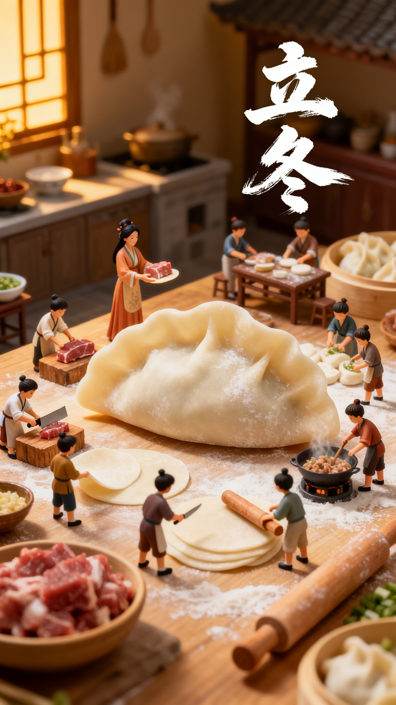
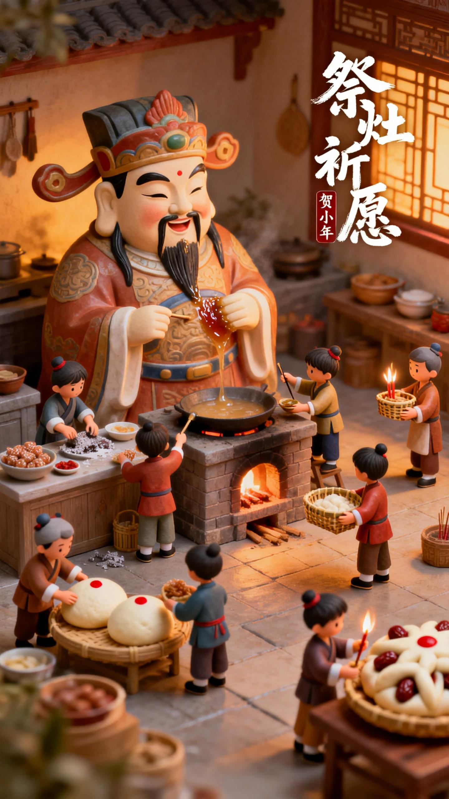
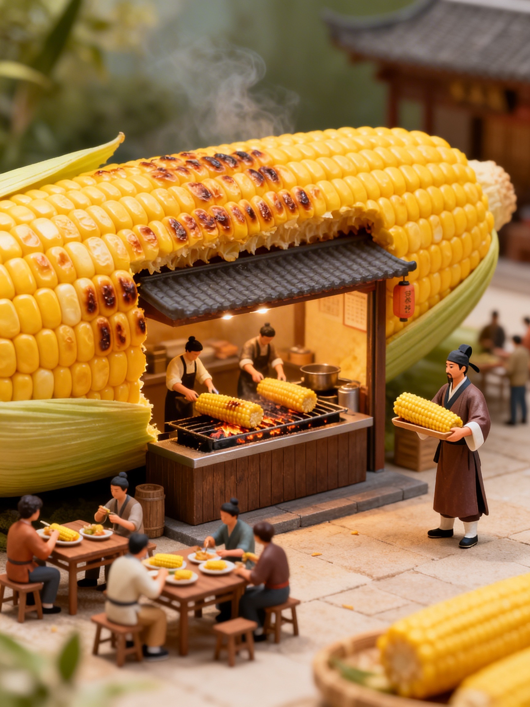
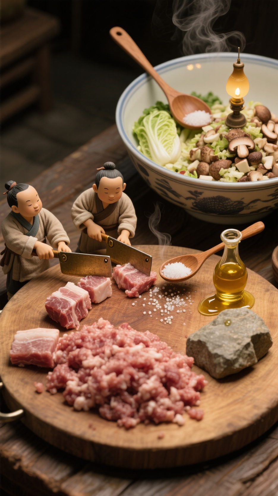
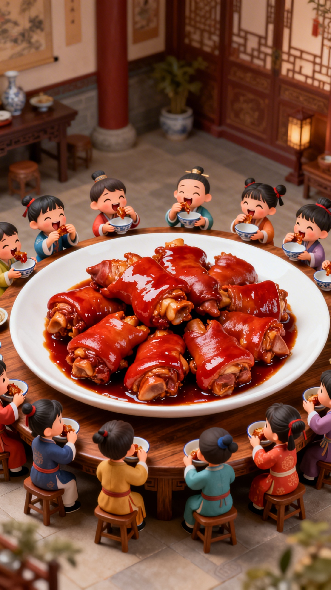
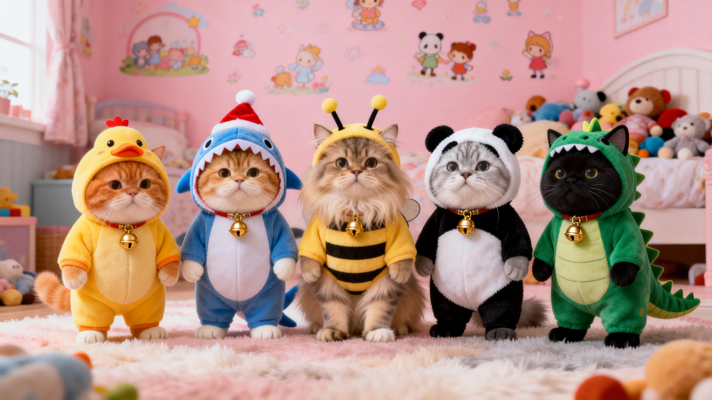

### 1. 小人国萌娃

#### 图片提示词

`小人国视角，一个穿着宋代汉服的男性萌娃，正抱着比自己还大的巨型烤白馍（已经被吃了一小口）从侧面啃咬，萌娃吃的满嘴流油，烤馍表面焦香流油，撒满辣椒面，冒着热气，背景是古色古香的木质食摊(招牌是图片中的logo)，背景可以虚化下，人物烤馍在图片整体占比很大，暖黄柔光，超写实，细节丰富，氛围感拉满`

`小人国视角，一个穿着宋代汉服的萌娃，梳着双丫髻，戴着金色珍珠发冠，正抱着比自己还大的巨型烤凤梨（参考图二，已经被吃了一小口）从侧面啃咬，萌娃吃的满嘴流油，烤凤梨表面焦香流油，撒满辣椒面和白芝麻，冒着热气，背景是古色古香的木质食摊(招牌是图片中的logo)，背景可以虚化下，人物烤串占比很大，暖黄柔光，超写实，细节丰富，氛围感拉满`

#### 视频提示词
`萌娃的嘴巴咬了一口肉，做出咀嚼动作在吃肉，小孩嘴角都是油，烤串轻微晃动，表面油珠滑落，烟雾缓缓升腾`

`叙事基调：温馨治愈，极度写实，软萌且垂涎欲滴。 主体/场景：特写镜头聚焦于一个4-5岁的东亚小男孩。他身穿精致的浅蓝色刺绣汉服（丝绸哑光质感），细腻的皮肤上有着细微汗珠。他正大口撕咬一只巨大的烤鸡腿——鸡腿表皮焦脆，泛着油脂光泽，撒有白芝麻与细碎辣椒粉。半透明的油脂从他嘴角滑落，被咬开的鸡肉鲜嫩多汁，冒着白烟的热气。他闭眼咀嚼，嘴角上扬，满足地晃动身体。 环境：傍晚黄昏的古风木制小吃摊位前，暖色调时刻。空气中弥漫着炭火微烟，背景是模糊的市井灯火。摊位挂着“蜀座停车场烧烤”木牌。 灯光：以3200K暖黄光为主。45°侧前方柔光箱作为主光，突出皮肤与油脂反光；阴影侧有柔和补光；135°后侧用强琥珀色轮廓光勾勒发丝与热气；鸡腿下方用反光板增强肉质通透感；利用负补光增加立体感；加入5%薄雾强化光线体积。 摄像机：采用9:16竖屏构图，人物居中略偏上，鸡腿占据画面下三分之一。使用35mm变形镜头，以极浅景深进行从特写（CU）到极特写（ECU）的缓慢微距推移（Push-in），焦点锁定在嘴角流下的油脂。 色调与后期：色板以琥珀、焦糖、柿子红、墨绿为主。采用高对比度S曲线，添加轻微镜头光晕、柔和胶片颗粒及高光光晕（Bloom），边缘轻微失焦。 持续性：保持汉服刺绣、鸡腿芝麻分布一致；暖色调与热气向上方向贯穿始终；萌娃头部始终轻微向右倾斜咀嚼。 音频：背景为60 BPM轻快民乐小调（笛子与木琴）。音效包括炭火滋滋声、咬碎脆皮的咔嚓声、油脂滴落声及满足的呼吸叹气。在1.5s撕咬瞬间降低背景音乐以突出咀嚼音。 对话与结构：单镜头8秒时长，节奏平缓。萌娃在1.0-3.0s含糊而兴奋地说：“唔！这个超好吃！”关键视觉节点：0s举起鸡腿张大嘴；2.5s咬下后油脂溢出；5s闭眼咀嚼露幸福笑；7.5s嘴角挂油憨笑定格。 一句话总结：实拍电影感竖屏短片；捕捉汉服萌娃在古风摊位前大口撕咬多汁烤鸡腿、油脂顺嘴角滑落的治愈瞬间；情感从期待转为极度满足；基调温暖且极具生活烟火气。`


### 2.烤肉广告
#### 图片提示词

`商业广告风格的分层拼接图，上下场景自然衔接，9:16纵向构图：`
`[上层场景，占比40%]：`
`繁忙热闹的餐厅后厨烧烤间。背景是不锈钢厨具、排烟罩和旺盛的炭火烤炉，火光映照，烟雾缭绕（充满烟火气）。一位经验丰富的烧烤师傅，穿着定制的“停车场烧烤”围裙，满头大汗，正专注地翻动着炉子上排列整齐、滋滋冒油的羊肉串。师傅侧着身子，右手抓着一把刚烤好、撒满调料的金黄羊肉串，跨越界面边界，直接从上层画面底部伸出，穿过中间信息条，传递向下方，一小半羊肉串已经穿到信息条层了。`
`[中间信息条，画面占比20%]：`
`简洁干净的社交媒体信息条界面（白底）。左侧放置红色的“蜀座”篆书印章Logo（参考图一；Logo右侧区域上方是黑色书法大字“停车场烧烤”。右侧设置一个正红色的圆角矩形框，框内用白色字体标注“爆卖10w+”`
`[下层场景，画面占比40%]：`
`明亮喧闹的“停车场烧烤”实体店内环境。一位年轻中国女性顾客坐在前景的木桌前，桌子上已经摆满了烧烤（参考图三），面带期待的笑容，高高抬起一只手朝向上一层的羊肉串，准备接过从上一层后厨递下来的热气腾腾的羊肉串。画面主要凸显这位美女的侧面，其他可作为背景，美女的手刚刚到中间层的下线`


#### 视频提示词
`固定镜头，下方的美女从上方师傅手里（拿签子的一端）接过师傅手里的羊肉串后，放到面前的盘子里，随后拿起一串吃了一口，然后看向镜头微笑，同时，上方烤串师傅递完手里的烤串后 ，手缩回，翻了翻面前的烤肉后面向镜头打招呼，下层背景的其他桌食客看起来很热闹，中间层保持不变`

### 3.烧烤江湖
#### 图片提示词：
`一只拟人化的英短虎斑猫厨师，穿着白色厨师服和灰色带红色挂带的围裙，在复古昏暗的街头烧烤摊前（招牌用图片中的logo），用夹子翻动烤架上的烤串。周围挂着暖黄色串灯，背景是破旧的木质墙面与布帘，摆放着调料瓶、锅具等杂物，整体氛围充满市井烟火气，写实风格，电影级暖光，细节丰富，8K高清。`
 
`补充细节`
 
`猫的表情严肃专注，正对着镜头看镜头，烤架上有滋滋冒油的烤物，地面散落着木炭，整体色调偏暖棕与暗蓝，带有颗粒感的复古质`

`图片比例：9:16`

#### 视频提示词
`核心画面是一只帅气的猫在充满烟火气的复古烧烤摊前，用夹子快速翻动烤架上滋滋冒油的烤肉，动作利落如侠客出刀。背景是暖黄色的炭火与木质摊位，搭配江湖风的刀光剑影特效和炭火噼啪的拟声。整体风格为写实+武侠氛围感，无任何对白`

`核心画面是一只帅气的猫在充满烟火气的复古灶台前，按顺序把旁边的辣椒和花蛤倒进锅里，用铲子快速翻炒食材，过程中也不断加入各种调料，动作利落如侠客出刀，最后呈现香辣花蛤的成品，背景是暖黄色的炭火与木质摊位。搭配江湖风的刀光剑影特效和炭火噼啪的拟声。整体风格为写实+武侠氛围感，无任何对白`


`侠义写实：灶火蛤王`

`场景主体 / 设定`
  `• 叙事基调：飒爽，充满烟火气`
  `• 主体类型：拟人化动作的猫（英国短毛猫，银渐层毛发）`
  `• 材质与表面：猫毛根根分明，带有细微的油烟光泽；复古铁锅呈现粗糙的铸铁质感，锅底带有烧红的金属色泽；辣椒皮质感油亮，花蛤壳带有湿润的海洋矿物反光。`
  `• 关键视觉元素：飞溅的红辣椒段、开壳的花蛤、升腾的锅气、如残影般的木铲。`
  `• 动作：猫爪持铲，横扫、挑锅、撒料，动作带有武侠片中的“快、准、狠”。`
  `• 比例：中景到特写切换，强调猫与巨大铁锅之间的力量对比。`

`角色与角色`
  `• 厨侠猫 – 眼神犀利，眉宇间透着宗师风范；动作利落，如同隐于市井的绝世高手。`

`环境`
  `• 地点：深夜的复古路边摊，木质结构的灶台。`
  `• 时间：深夜，光线集中在灶台区域。`
  `• 天气/氛围：空气中弥漫着辛辣的烟雾，炭火星子在空中飞舞。`
  `• 光影质量：暖调火光，高对比度，带有强烈的戏剧性。`
  `• 深度层次：前景：飞溅的辣椒与调料 / 中景：猫与铁锅、灶台 / 背景：模糊的木质摊位、悬挂的红灯笼。`

`灯光 (技术设置)`
  `• 主光：45° 侧前方 强力 3200K 暖橙色火光，模拟炭火的脉动。`
  `• 补光：1:4 柔和 阴影区 位于右侧，保持暗部细节。`
  `• 轮廓光：180° 冰蓝色 极高强度，勾勒猫的毛发边缘，营造武侠片的冷峻感。`
  `• 装饰光：锅底隐藏的红色LED，增强食材受热的视觉冲击力。`
  `• 负补光：控制背景暗度，确保主体突出。`
  `• 调节器：5% 浓度烟雾，配合容积光效果，捕捉飞舞的炭灰。`

`摄像机 (运动与构图)`
  `• 镜头：WS（全景开场）/ MS（炒菜过程）/ CU（辣椒入锅）/ ECU（花蛤开口瞬间）。`
  `• 构图：九宫格构图，猫眼始终处于上三分之一线。`
  `• 运动：单一的推入镜头（Push-in），随着翻炒动作逐渐加速，增加紧迫感。`
  `• 镜头焦段：35mm 变形镜头，带来宽阔的视野与独特的椭圆光斑。`
  `• 焦距：浅景深，焦点紧跟猫爪与食材。`
  `• 覆盖范围：主镜头配合食材飞溅的特写插镜。`

`调色 (后期)`
  `• 色调：琥珀色/深红/墨绿。`
  `• 曲线：强S型曲线，强化黑场，提升高光部分的火光亮度。`
  `• 特效：光晕效果（Bloom）；轻微胶片颗粒；色差（CA）模拟高速动作；刀光剑影的白色流光特效。`

`延续性`
  `• 视觉：猫的眼神始终锁定锅内，围裙上的油渍保持一致。`
  `• 灯光：炭火的明暗闪烁频率保持恒定。`
  `• 方向：翻炒动作由左向右横扫。`

`音频 (精确计时)`
  `• 背景音乐：快节奏的古筝与大鼓，140 BPM，武侠风。`
  `• 音效：炭火噼啪声、金属碰撞声、食材入油锅的滋啦声、利刃划破空气的啸叫声。`
  `• 关键点：0.5s 沉重鼓点开场；2.5s 辣椒入锅的爆裂声；5.0s 花蛤撞击铁锅的清脆声；8.5s 铲子划过锅底的金属摩擦声；11.0s 调料撒入的沙沙声；13.0s 最后一击收招的静止声；14.5s 炭火余烬的微弱响声。`
  `• 混音：在动作高潮处降低背景音乐，突出食材翻滚的物理音效。`

`对白`
  `• 无对白。`

`结构 (剪辑)`
  `• 模式：快节奏剪辑（Jump-cut）；时长：15s；节奏：1.8（极快）。`
  `• 剪辑频率：每0.6-0.8秒切换一次画面。`
  `• 转换：硬切配合闪白特效。`
  `• 关键视觉：`
    `- 0.0s **厨侠猫** 眼神特写，火光在瞳孔中跳跃 [ECU]`
    `- 2.0s **辣椒** 呈螺旋状飞入红油锅中 [CU]`
    `- 4.5s **花蛤** 倾泻而下，伴随刀光特效 [MS]`
    `- 7.5s **猫爪** 快速翻炒，木铲拉出残影 [MS]`
    `- 10.0s **调料** 像暗器一样精准撒入锅心 [CU]`
    `- 12.5s **成品** 香辣花蛤在大火中翻滚定格 [CU]`
    `- 13.5s **猫** 端着做好的香辣花蛤递到屏幕前， [WS]`
  `• 结尾：画面在14.8s处定格，随后黑场。`

`___`

`Output · 一句话总结`
`写实武侠风短片；猫大厨在复古灶台前以刀法炒制香辣花蛤，动作利落，火光四射；情绪从紧凑转向圆满；基调热血且极具烟火气。`

### 4.创意短片（动物从图片出来跳到盘子里）
#### 图片提示词


#### 视频提示词
`创意短片，固定镜头，图片中的羊往前开始走，快到盘子的时候开始往盘子里跳，跳的过程中身上开始起火，到盘子的时候就变成两串羊肉串放到盘子里了，其他羊在正常吃草`


### 5.食材解析竖版
#### 图片提示词
`At the very top center of the composition, floating prominently above the ingredient layers, is a luxurious title label. The text reads "油泼鱼 SPICY OIL-POURED FISH" rendered in expressive, handwritten Chinese brush calligraphy (毛笔字) style. The lettering possesses a heavy, three-dimensional sculpted gold metal texture (金属质感) with a brushed finish, warm golden sheen, and realistic metallic reflections catching the dramatic studio lighting. It looks like forged gold brushstrokes floating in space.`

`Premium Chinese Sichuan restaurant food poster featuring deconstructed layers of Spicy Oil-Poured Fish / Sichuan Spicy Whole Fish floating in vertical stack on pure black background (#000000). Seven distinct layers from top to bottom (below the main gold title) with extra spacing before the final dish:`

- `Top layer: pile of bright red dried chili segments, deep red dried chili flakes, golden-brown mixed green and red Sichuan peppercorns, toasted Sichuan peppercorn powder`
- `Second layer: golden crispy minced garlic, shredded ginger, vibrant green chopped scallions and green onion strips, scattered lightly`
- `Third layer: a whole fresh sea bass / perch fish, complete head and tail, smooth silvery white skin, plump and tender body, with diagonal slits cut on both sides, clean and glossy texture, lying flat elegantly`
- `Fourth layer: crisp bean sprouts, enoki mushrooms, baby bok choy, cabbage slices — these fresh vegetables are laid at the bottom of the bowl first`
- `Fifth layer: transparent glass bowl filled with deep red spicy Sichuan chili oil broth, floating chili pieces and Sichuan peppercorns visible, glossy surface with reflections - this soup base is poured over the vegetables, so it appears BELOW the vegetables in the vertical stack`
- `Sixth layer: EMPTY SPACE - a larger gap with only subtle floating oil droplets, steam wisps, and small ingredient particles drifting down, creating visual separation and breathing room`
- `Bottom/Final layer (with significantly larger gap above): a complete finished Spicy Oil-Poured Whole Fish dish in a traditional dark brown ceramic bowl, viewed from the same 45-degree angled perspective as all other layers above. The bowl contains all ingredients combined - a whole fish soaked in glossy red spicy chili oil, topped with dried chilies, Sichuan peppercorns, minced garlic, shredded ginger, green scallions, and white sesame seeds. The fish skin glistens with oil, tender and juicy, subtle steam rising. This finished bowl is at the same scale and viewing angle as the deconstructed ingredients above. The extra spacing above emphasizes this as the final result, creating a dramatic reveal of the transformation from separated components to complete dish.`

`Each layer separated with gaps revealing textures and details. Layers 1-5 have normal spacing between them. Layer 6 is an intentional empty transition space with double or triple the normal gap distance. Layer 7 (finished dish) sits at the bottom with clear visual separation. Chinese and English bilingual labels with elegant arrows pointing to each component: "干辣椒 & 青红花椒 Dried Chilies & Sichuan Peppercorns", "麻辣干香 Numbing & Spicy Aroma", "姜蒜 & 葱花 Ginger Garlic & Scallions", "整条鲜鱼 Whole Fresh Fish", "垫底配菜 Base Vegetables", "红油汤底 Spicy Red Broth", "成品油泼鱼 Finished Spicy Oil-Poured Fish".`

`NO white pedestal, NO platform base. All layers float freely in space against pure black background. Dramatic studio lighting from 45-degree angle, rim lighting highlighting textures, fish skin smoothness, vegetable crispness and glass bowl transparency. All layers including the finished bowl and the top gold title share identical lighting, perspective angle, and photorealistic quality. Subtle steam effects, oil droplets floating around layers, with more particles in the empty transition space. Star sparkle effect in bottom right corner near the finished dish. Dark moody aesthetic, luxurious commercial food photography style, ultra-realistic, highly detailed, professional restaurant advertising quality, 9:16 vertical format, 8K, hyper-detailed, mouth-watering, cinematic lighting.`

#### 视频提示词
`固定镜头，锅保持不动，食材按顺序一边上升悬浮一边分层，最后展示最上面的标题“黄鱼烧豆腐”，过渡自然，MG动画`

### 6. 食材横版拆解
#### 图片提示词
```
# 豆花鱼横版海报（16:9）完整提示词

16:9 横版，纯黑背景，高端川菜馆商业美食海报，超写实，电影级布光，8K 高清，暗调奢华，高级黑金配色，所有元素悬浮空中，无底座、无箭头、无盘子。

整体布局：左侧为垂直悬浮食材分层，每层食材旁横排标注金色文字；右侧上半部分为双口味酱料碗，下半部分为成品豆花鱼。

### 左侧垂直悬浮食材（从上到下）

1. 第一层：鲜红干辣椒段、青红花椒混合堆叠，颗粒分明，质感油亮；旁边横排金色文字：干辣椒 花椒
2. 第二层：姜片、蒜末、葱花、香菜段混合，新鲜翠绿；旁边横排金色文字：姜蒜 葱花香菜
3. 第三层：新鲜白嫩鱼片，纹理清晰，肉质紧实；旁边横排金色文字：鱼片
4. 第四层：酸菜、酸笋混合，色泽自然；旁边横排金色文字：酸菜 酸笋
5. 第五层：嫩滑豆花块，洁白细腻，微微透光；旁边横排金色文字：豆花
    
    各食材层间留有空隙，点缀油光、细微水汽与蒸汽，质感真实。

### 右侧上半部分：双口味酱料

- 左侧酱料碗：藤椒味酱料，鲜绿色，表面漂浮青花椒颗粒，碗下方标注金底黑字 “藤椒料”，字体精致，边缘带光泽
- 右侧酱料碗：麻辣味酱料，深红色，表面漂浮辣椒碎，碗下方标注金底黑字 “麻辣料”，字体精致，边缘带光泽
    
    酱料碗悬浮空中，边缘带油光，质感浓郁。

### 右侧下半部分：成品豆花鱼

中央展示一锅完整豆花鱼，采用与参考图完全一致的**略微俯视 45 度平视角度**，金属锅具带有回纹装饰边缘，锅内鱼片、豆花、酸菜、酸笋混合，汤汁呈浓郁红油色，表面铺满干辣椒、青红花椒、葱花，热气袅袅升腾，与左侧食材风格统一。

### 光影与氛围

45 度侧光 + 柔和轮廓光，突出食材鲜嫩、汤汁油亮、酱料浓郁质感。纯黑背景，暗调奢华，视觉焦点集中，商业美食摄影质感，细节极致，色彩浓郁诱人。
```

#### 形式二
`纯黑色背景，专业美食摄影，电影级柔和聚光灯打光，突出食材细节与新鲜感。`

`左侧保留完整的黄鱼烧豆腐成品轮廓，作为视觉锚点；右侧将所有食材分层垂直悬浮展示，层间保留清晰空隙，严格按原菜品堆叠顺序拆解：`

1. `**最底层**：嫩豆腐块，保持原方块形态与细腻质感`
2. `**第二层**：完整煎制大黄鱼，保留金黄焦香的表皮纹理`
3. `**第三层**：浓稠红亮的红烧酱汁，带有细小辣椒碎与油光`
4. `**第四层**：鲜红小米辣段、干辣椒碎`
5. `**顶层**：翠绿葱花碎`

`每一层悬浮食材旁，用白色简洁标注线连接对应文字标签：「嫩豆腐」「大黄鱼」「红烧酱汁」「小米辣 & 干辣椒」「葱花」，标注醒目且不遮挡食材。整体画面无额外装饰，仅聚焦食材解构，呈现高级、干净的电影质感美食摄影效果。`

### 7.小人国节日参考
#### 图片提示词
##### 形式一
```
古风微缩场景，身着传统中国服装的女性小人儿们在厨房准备包饺子的材料，一片巨大的饺子，有很多小孩，有的小孩们托面皮，有的小孩们拿刀割肉，有的小孩们剁肉馅，还有的小孩们在擀面杖，有的小孩在擀面皮，有的小孩们准备煮饺子动作，有的小孩们包饺子，非常热闹的忙碌着的景象，立冬的狂草书文案
```

##### 形式二
```
‌3D场景小人古风微缩场景，身着传统中国服装的小人儿们在厨房准忙碌着，一片巨大的灶神，有很多小孩，有的小孩们准备吃的，有的小孩们手拿灶糖，有的小孩们清理灶台，还有的小孩们在用麦芽糖浆涂在灶君画像的嘴角，有的小孩踮脚递上竹编食盒，有的小孩们蒸得松软的枣花馍，馍顶红点如朱砂痣。，有的小孩们手拿香火，非常热闹的忙碌着的景象，合适的地方加上祭灶祈愿的狂草书文案边上小字贺小年。
```


##### 形式三
```
一个巨大的烤玉米做成的店铺，玉米一面开着口，里面几个人正在忙着制作烤玉米，外面有露天的桌子，好多人正在吃着烤玉米，还有穿着古装的店小二端着烤玉米，海报设计，微距摄影，微缩景观，高清
```

##### 形式四：
```
古风风格，微缩景观，微距摄影，镜头以近景拍摄，采用平视角度，光线柔和，营造出室内温馨祥和的氛围，画面为高清画，运用超高精度微缩模型渲染技术，细腻地展现出场景和人物的精致细节，具有逼真的质感，一群穿着汉服的可爱微观小人围着巨大的白菜、萝卜、肉块等年夜饭食材，有的在搬食材，有的在清洗
```

##### 形式五
```
近景，俯视角度，温暖油灯照明，高清画质，超高精度微缩模型渲染技术。巨大的木砧板上，猪肉块如石块般摆放，三个宋代迷你小人用小型铜刀（刀刃仅比手掌大）轮流剁肉（避免巨大刀具），肉末逐渐堆积。旁边巨大的瓷盆里，白菜碎、香菇丁堆成小丘，两个小人用长柄木勺搅拌，一人撒盐（盐粒如小珠），一人倒香油（香油瓶倾斜，细线般的油滴落），馅料上冒着细微热气。

```

##### 形式六
```
远景，平视，温馨室内光，微缩景观设计，超高清画质，电影质感，3D卡通渲染技术，古代厅堂场景，古代大木桌上巨大白瓷盘盛满红亮红烧猪蹄（每个猪蹄比小人还大），多个穿着各色古代服饰的Q版迷你小男孩小女孩围坐桌边，每人手里捧着一个碗，有的小人直接用小手抓着猪蹄啃，嚼完一口又急切的咬一大口，猪蹄的酱汁沾满脸庞，亮晶晶眼睛笑成弯月，肉嘟嘟脸蛋鼓鼓的，充满满足欢乐的氛围，突出食物与小人的夸张体积差

```

##### 形式七
```
小人国吃火锅 微观视角下，小人国古雅的室内，木桌上摆放着热气腾腾、色泽诱人的火锅。身着古风汉服的迷你女娃缩小人围坐在一起，手持小巧竹筷，准备享用美食。有的女娃专注地夹起肉片，轻轻吹气；有的女娃已经咬上一口，有的正在吃考肉，有的正在吃青菜 露出满足的神情。桌上还摆放着白糖、酱料等小碗，一旁的架子上放着备用的土豆粉 宽粉 娃娃菜等。背景中可见室内的古雅布置，营造出温馨热闹的氛围。逼真，高清，辛烷渲染边缘发光，质感，纹理清晰。
```

#### 视频提示词
```
构造一个自然，活动的场景，有手上动作，又互相交流，动画片品质
```
```
镜头从厅堂远景慢慢拉近，聚焦每个小女孩们啃猪蹄的可爱模样，特写一个小女孩肉嘟嘟的脸蛋沾满酱汁，非常满足眼神，嚼完一口又急切地咬下一大块，嘴角扬起开心的笑容。画面采用电影质感，8k高清呈现，特写女孩与巨无霸猪蹄的互动，细节清晰到能看见猪蹄表皮的焦香纹理与滴落的酱汁，一口咬下去蹄筋黏糯拉丝，碗边还放着两块啃完的骨头，氛围充满淳朴的食欲感，最后环绕拍摄众人围坐的热闹画面，强化体积对比
```

### 8.小猫跳舞
#### 图片
```
正面视角，萌宠派对，分别是五只小胖猫（橘猫、金渐层、长毛猫、银渐层、黑猫）拟人化双脚站立，按顺序分别穿着小黄鸭、圣诞鲨鱼、蜜蜂、熊猫、恐龙主题的连体动物服，脖子挂金色铃铛，背景是馨儿童房，写实摄影风格，柔和暖光，高细节，8K
```

#### 视频提示词
```
固定镜头下，五只小动物随音乐跳蟹二摇，同步甩头侧身，交替扭臀摆胯，脚步配合左右移步，背景保持不变
```
